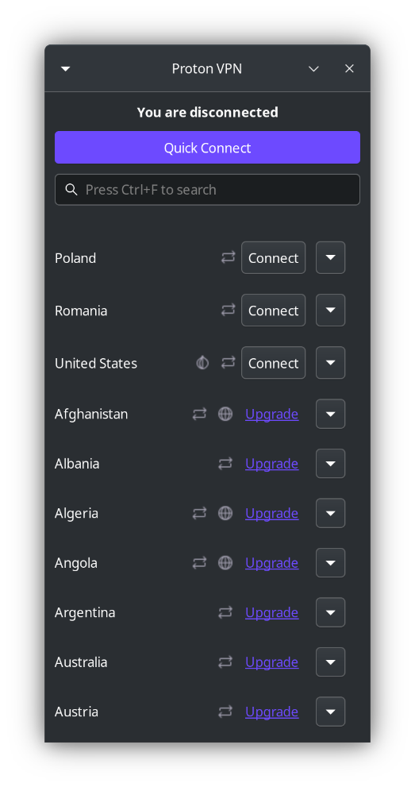
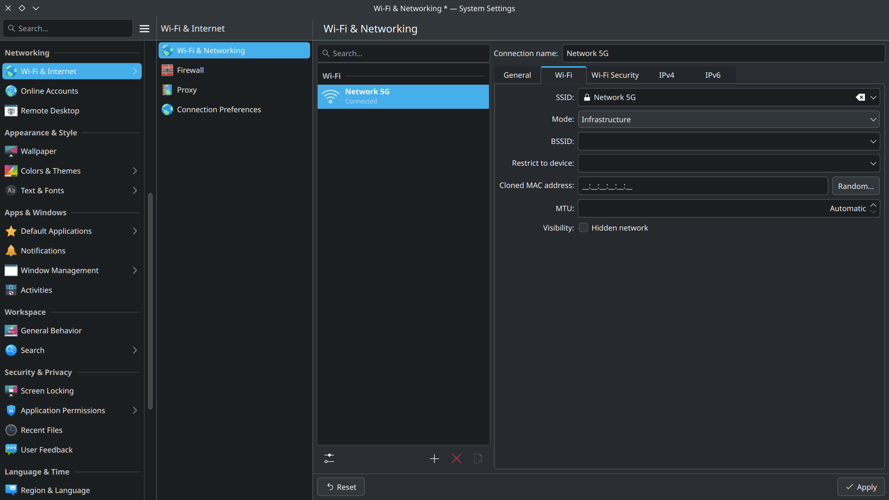
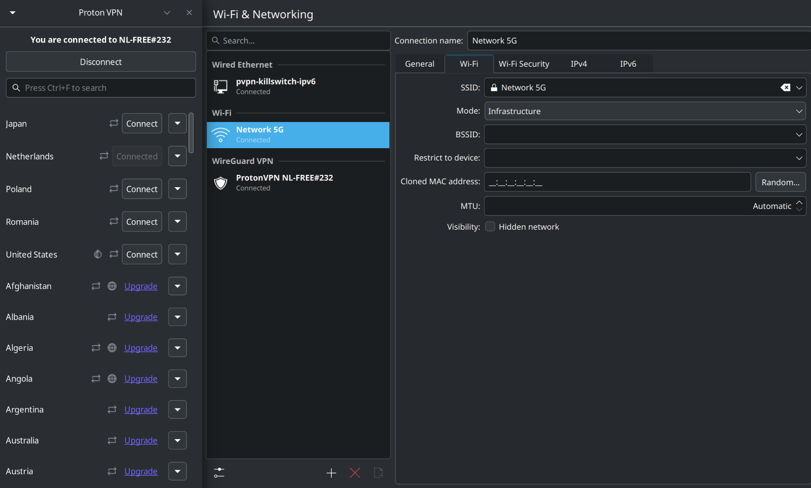

# ElateLabs-task8
This repository displays the benefits and working with vpn (Proton VPN)

1. Installation of ProtonVPN

> Archlinux : can be installed through AUR using yay or paru maintained by community

```
    $ yay -S proton-vpn-gtk-app
```

> Debaian based systems : 

Can be installed using official .deb file for debian based systems

> Fedora based systems :

Can be installed through offical .rpm file for fedoara and RHEL based systems

2. Initialization of ProtonVPN

After installing protonVPN initialize the app and login to your proton account to use vpn after which you will get on landing page for initiallizing the vpn connection



below displays the networks before connecting to vpn



3. Connection with vpn

